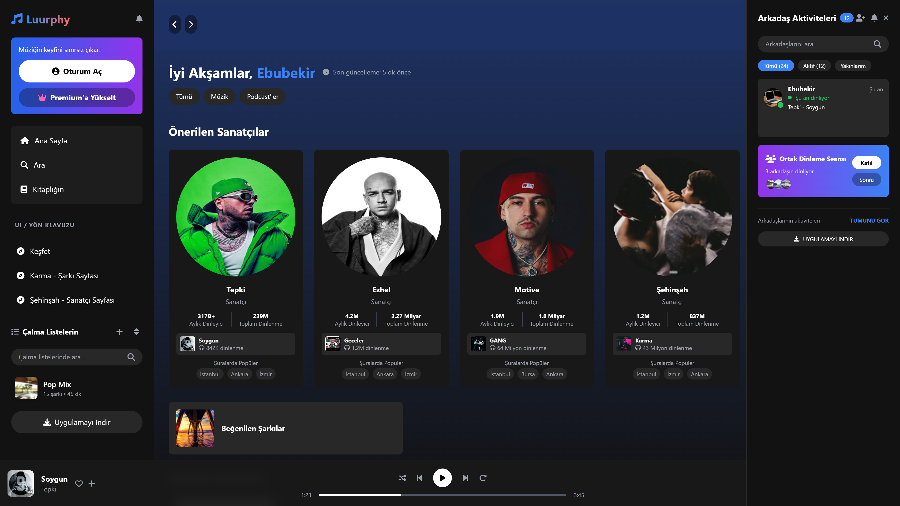

# Luurphy - Hayatı an'da yaşa!

Modern ve kullanıcı dostu bir müzik dinleme uygulaması arayüzü. HTML, CSS, JavaScript ve Tailwind CSS kullanılarak geliştirilmiştir.

## Özellikler

### Ana Sayfa (index.html)
- Modern ve duyarlı tasarım
- Özel tasarlanmış sol menü
- Oturum açma ve premium üyelik seçenekleri
- Çalma listeleri yönetimi 
- Önerilen içerikler ve karışımlar
- Yakında çalınanlar bölümü
- Tam işlevsel müzik çalar
- Arkadaş aktiviteleri paneli

### Sanatçı Profili (artist.html)
- Etkileyici hero bölümü
  - Animasyonlu parçacık efekti
  - Paralaks kaydırma efekti
  - Gradient overlay
- Detaylı sanatçı istatistikleri
  - Aylık dinleyici trendi
  - Popüler şehirler analizi
  - Dinleyici yaş dağılımı
  - Günlük dinlenme saatleri grafiği
- İnteraktif şarkı listesi
  - Hover animasyonları
  - Müzik dalgası efekti
  - Anlık istatistikler
- Özel koleksiyonlar
  - Aylık en iyiler
  - Akustik versiyonlar
  - Remix koleksiyonu
- Albüm galerisi
  - 3D hover efekti
  - Parıltı animasyonu
  - Detaylı albüm bilgileri
- Sanatçı hakkında
  - Biyografi
  - Sosyal medya bağlantıları
  - İstatistikler
- Benzer sanatçılar
- Yaklaşan konserler

### Tasarım Özellikleri
- Gradient arka planlar ve efektler
- Özel scrollbar tasarımı
- Yumuşak geçiş animasyonları
- Gelişmiş hover efektleri
- Responsive grid yapısı
- Modern ikonlar
- Şık renk paleti
- Cam efekti (glassmorphism)
- 3D kart dönüşümleri
- Parıltı animasyonları

### Animasyonlar
- Müzik dalgası efekti
- Parçacık animasyonu
- Gradient geçişler
- Kart hover animasyonları
- Slide-in efektleri
- Pulse animasyonları
- Parıltı efektleri
- 3D dönüşüm efektleri
- Fade-in animasyonları

### Responsive Özellikler
- Mobil uyumlu tasarım
- Adaptif grid sistemi
- Mobil-dostu butonlar
- Touch destekli etkileşimler
- Safe area desteği

### CSS Özellikleri
- Özel scrollbar stilleri
- Gradient efektler
- Hover animasyonları
- Kart hover efektleri
- Animasyonlu arka planlar
- Glassmorphism efektleri
- Custom transitions
- Keyframe animasyonları

### Şarkı Sayfası (song.html) - Yeni Eklenenler
- Detaylı şarkı bilgileri ve istatistikler
- Tam şarkı sözleri ve zaman çizelgesi
- Şarkı analizi ve popüler alıntılar
- Topluluk yorumları ve etkileşimleri
- Konser fotoğrafları galerisi (Swiper.js ile)
- Lightbox görüntü görüntüleyici (Fancybox ile)
- Radyo istasyonları ve podcast önerileri
- Benzer şarkılar önerisi
- Kullanıcı notları sistemi
- Dinlenme istatistikleri ve grafikler

## Kullanılan Teknolojiler
- HTML5
- CSS3
  - Flexbox
  - Grid
  - Animations
  - Transforms
  - Custom Properties
- JavaScript
- Tailwind CSS
- Font Awesome

### Yeni Eklenen Teknolojiler
- Swiper.js (Slider/Carousel)
- Fancybox (Lightbox)
- jQuery

## Ekran Görüntüleri

### Ana Sayfa

- Sol menü ve çalma listeleri
- Önerilen içerikler
- Müzik çalar

### Şarkı Sayfası

- Detaylı şarkı bilgileri ve istatistikler
- Tam şarkı sözleri ve zaman çizelgesi
- Şarkı analizi ve popüler alıntılar
- Topluluk yorumları ve etkileşimleri
- Konser fotoğrafları galerisi (Swiper.js ile)
- Lightbox görüntü görüntüleyici (Fancybox ile)
- Radyo istasyonları ve podcast önerileri
- Benzer şarkılar önerisi
- Kullanıcı notları sistemi
- Dinlenme istatistikleri ve grafikler

### Sanatçı Profili

- Hero bölümü
- İstatistikler
- Şarkı listesi
- Albümler

### Keşif Sayfası

- Önerilen içerikler ve karışımlar
- Yakında çalınanlar bölümü
- Müzik çalar

## Planlanan Geliştirmeler
- Şarkı sözleri görünümü
- Kullanıcı profili sayfası
- Playlist oluşturma sayfası
- Mobil görünüm optimizasyonu
- Drag & drop playlist yönetimi
- Çapraz platform senkronizasyonu
- Sosyal medya entegrasyonu
- Canlı etkinlik entegrasyonu
- Mini oynatıcı modu
- Kişiselleştirilmiş öneriler

## Katkıda Bulunma
1. Bu depoyu fork edin
2. Yeni bir branch oluşturun (`git checkout -b feature/amazing-feature`)
3. Değişikliklerinizi commit edin (`git commit -m 'Yeni özellik: Muhteşem özellik'`)
4. Branch'inizi push edin (`git push origin feature/amazing-feature`)
5. Bir Pull Request oluşturun

## Lisans
Bu proje MIT lisansı altında lisanslanmıştır. Detaylar için [LICENSE](LICENSE) dosyasına bakın.

## İletişim
Proje bağlantısı: [https://github.com/ebuword/luurphy](https://github.com/ebuword/luurphy)